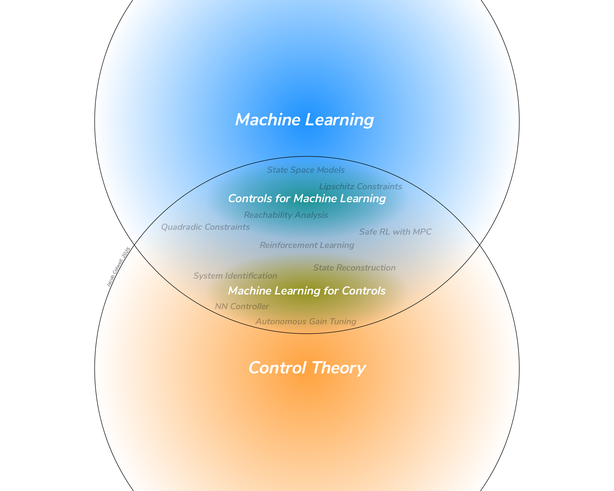
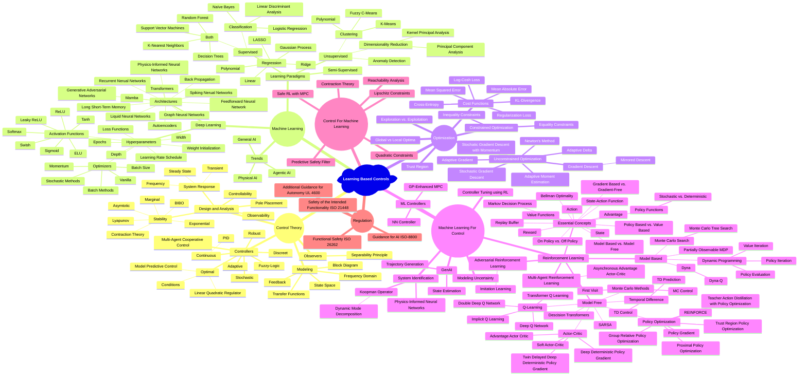

# Awesome Learning-Based Controls

Learning-Based Controls is an emerging field at the intersection of Control Theory for Dynamic Systems and Machine Learning, particularly Deep Learning and Reinforcement Learning. This repository serves to curate resources relevant to the field, including introductory information on ML and Controls, topics in LBC, applications of LBC, tools for implementing LBCs, and more.

This repository was originally developed by Jacob Colwell (@jgreen020) as a student project for courses in Learning-Based Controls (MECHENG 6193, MECHENG 7194) taught at The Ohio State University in the Spring and Autumn semesters of 2025 by Dr. Qadeer Ahmed and Dr. Sidra Ghayour Bhatti.

## Table of Contents
- [Awesome Learning-Based Controls](#awesome-learning-based-controls)
	- [Table of Contents](#table-of-contents)
	- [Background](#background)
		- [Control Theory](#control-theory)
		- [Machine Learning (Non RL)](#machine-learning-non-rl)
		- [Optimization](#optimization)
	- [Machine Learning For Control](#machine-learning-for-control)
		- [System Identification / Dynamic System Reconstruction](#system-identification--dynamic-system-reconstruction)
		- [ML Observers](#ml-observers)
		- [ML for High-Level Control](#ml-for-high-level-control)
		- [ML Controllers](#ml-controllers)
		- [Controller Tuning](#controller-tuning)
		- [Reinforcement Learning](#reinforcement-learning-1)
	- [Control For Machine Learning](#control-for-machine-learning)
		- [Dynamic Systems Inspired Models](#dynamic-systems-inspired-models)
	- [Regulation](#regulation)
		- [Autonomous Vehicles](#autonomous-vehicles)
		- [Robotics and Automation](#robotics-and-automation)
		- [General Machine Learning / AI Systems](#general-machine-learning--ai-systems)
	- [Tools](#tools)
		- [General Tools for Machine Learning or Control](#general-tools-for-machine-learning-or-control)
		- [Specific Tools for Learning-Based Controls](#specific-tools-for-learning-based-controls)
	- [Tutorials](#tutorials)
	- [Applications](#applications)
		- [ME7194 Spring 2025 Projects](#me7194-spring-2025-projects)
		- [ME6193 Autumn 2025 Projects](#me6193-autumn-2025-projects)
	- [Further Reading](#further-reading)
		- [Awesome Lists](#awesome-lists)
		- [Lectures / Courses](#lectures--courses)
		- [Textbooks](#textbooks)
## Background
### [Control Theory](https://archive.org/details/systemdynamics0000palm_h7i2/mode/2up)
Control Theory is one of the foundational fields from which Learning-Based Control Arises. The following is a non-comprehensive list of concepts from Control Theory that will be important to understand before exploring concepts in Learning-Based Control. Most of these concepts can be explored in the linked textbook, unless otherwise linked. See [Awesome Control Theory](https://github.com/A-make/awesome-control-theory) for a more comprehensive list of topics, resources, and tools.
#### Essential Topics
- Modeling (State Space, Transfer Functions, Frequency Domain)
- System Response (Steady State, Transient, Frequency)
- Stability (Lyapunov, Asymtotic, Marginal, etc.)
- Observability
- Controllability
#### Control Strategies / Subfields
  - [Adaptive Control](https://www.researchgate.net/publication/299747127_Robust_Adaptive_Control)
  - [Robust Control](https://archive.org/details/isbn_9788131718872/page/n7/mode/2up)
  - [Optimal Control](https://archive.org/details/optimalcontrolth0000kirk/page/n9/mode/2up)
  - [Model Predictive Control](https://sites.engineering.ucsb.edu/~jbraw/mpc/)
  - [Stochastic Control](https://www.sciencedirect.com/bookseries/mathematics-in-science-and-engineering/vol/70/suppl/C)
  - [Multi-Agent Cooperative Control](https://doi.org/10.1109/AIHCIR61661.2023.00089)
### [Machine Learning (Non RL)](https://www.statlearning.com)
It is also important to understand the fundamentals of machine learning and deep learning. Exploring non-deep methods before deep ones may help motivate the deep approaches. As before, these concepts can be explored in the linked textbook, unless otherwise linked. See [Awesome Deep Learning](https://github.com/ChristosChristofidis/awesome-deep-learning#readme) for a more comprehensive list of topics, resources, and tools.
#### Essential Concepts
- Paradigms (Regression, Classification)
- Supervision (Supervised, Unsupervised, Semi-Supervised, Self-Supervised, etc.)
- Tasks (Language, Reasoning, Visual, Audio, etc.)
#### Notable Loss Functions
- Mean Absolute Error
- Mean Squared Error
- [Log-Cosh Loss](https://arxiv.org/abs/2208.04564)
- Cross-Entropy
- [KL-Divergence](https://www.geeksforgeeks.org/machine-learning/kullback-leibler-divergence/)
- Regularization Loss
#### Deep Learning Architectures
- Feedforward Neural Network
- Recurrent Neural Networks
- Long Short-Term Memory
- Transformers
- Autoencoders
- Generative Adversarial Networks
- Diffusion Models
- [Graph Neural Networks](https://distill.pub/2021/gnn-intro/)
- [Graph Convolutional Networks](https://arxiv.org/abs/1609.02907)
- [Graph Attention Networks](https://arxiv.org/abs/1710.10903)
- [Spiking Nerual Networks](https://github.com/yfguo91/Awesome-Spiking-Neural-Networks?tab=readme-ov-file#Codes_and_Docs)
- [Mixture of Experts](https://github.com/XueFuzhao/awesome-mixture-of-experts)
- [Teacher-Student (Knowledge Distillation)](https://arxiv.org/abs/1503.02531)
#### Deep-Learning Trends
  - Physical AI
  - General AI
  - Agentic AI
  - Explainable AI
  - Artificial General Intelligence
### [Optimization](https://web.stanford.edu/class/ee364a/)
Mathematical Optimization is fundamental to topics in Machine Learning and Optimal Control. Advanced topics from optimization are employed in Learning-Based Controls Techniques, so it is useful to expand on them here. See [Awesome Optimization](https://github.com/ebrahimpichka/awesome-optimization) for a more comprehensive list of topics, resources, and tools.
#### Essential Concepts
- Convexity
- Global vs Local Optima
- Equality and Inequality Constraints 
- Exploration vs. Exploitation
#### Methods
- Gradient Descent
- Newton's Method
- [Stochastic Gradient Descent (SGD)](https://probml.github.io/pml-book/book1.html)
- [Stochatic Gradient Descent with Momentum](https://www.nature.com/articles/323533a0)
- [Adaptive Gradient (AdaGrad)](https://jmlr.org/papers/volume12/duchi11a/duchi11a.pdfat)
- [Adaptive Moment Estimation (ADAM)](https://arxiv.org/abs/1412.6980)
- [Mirrored Descent](https://www.cs.cmu.edu/afs/cs.cmu.edu/academic/class/15850-f20/www/notes/lec19.pdf)
- Trust Region Optimization
## Machine Learning For Control
Learning-Based Control is the intersection of Machine Learning and Control Theory, so topics in Learning-Based Control lie on a spectrum between the two fields. We generally split this spectrum into two groups. Topics that involve implementing Machine Learning into the control loop (_e.g._ estimating an element in the control loop) or using Machine Learning Models as controllers (_e.g._ Neural Network Controllers, Reinforcement Learning) are categorized as __Machine Learning for Control__.
### System Identification / Dynamic System Reconstruction
System Identification is the process of modeling Dynamic Systems based on data. In the most simple cases (1st- or 2nd-order aproximately-linear systems) it is possible to accurately model them using simple white-box models. For more complicated systems, more advanced statistical models can be used to learn the behavior of the dynamic system, including Deep Learning methods. Using probabilistic machine learning models, we can model uncertainties and/or disturbances in the plant, allowing for more robust controller design with stability and safety guarantees.
#### Sparse Identification of Nonlinear Dynamics (SINDy)
- [Discovering governing equations from data: Sparse identification of nonlinear dynamical systems](https://arxiv.org/abs/1509.03580)
- [Constrained sparse Galerkin regression](https://doi.org/10.1017/jfm.2017.823)
- [Sparse identification of nonlinear dynamical systems via reweighted $l_1$-regularized least squares](https://doi.org/10.1016/j.cma.2020.113620)
- [Weak SINDy: Galerkin-Based Data-Driven Model Selection](https://doi.org/10.1137/20M1343166)
#### Physics-Informed Neural Networks
- [Physics Informed Deep Learning (Part I): Data-driven Solutions of Nonlinear Partial Differential Equations](https://arxiv.org/abs/1711.10561)
- [An Expert's Guide to Training Physics-informed Neural Networks](https://arxiv.org/abs/2308.08468)
- [Physics-Informed Neural Nets for Control of Dynamical Systems](https://arxiv.org/abs/2104.02556)
#### Koopman Operators
- [Deep learning for universal linear embeddings of nonlinear dynamics](https://arxiv.org/abs/1712.09707)
- [Modern Koopman Theory for Dynamical Systems](https://arxiv.org/abs/2102.12086)
- [Forecasting Sequential Data using Consistent Koopman Autoencoders](https://arxiv.org/abs/2003.02236)
#### Reccurent Neural Networks
- [Synthesis of recurrent neural networks for dynamical system simulation](https://doi.org/10.1016/j.neunet.2016.04.001)
- [Optimal Recurrent Network Topologies for Dynamical Systems Reconstruction](https://proceedings.mlr.press/v235/hemmer24a.html)
- [Almost-Linear RNNs Yield Highly Interpretable Symbolic Codes in Dynamical Systems Reconstruction](https://arxiv.org/abs/2410.14240)
#### Time-Series Foundation Models
- [True Zero-Shot Inference of Dynamical Systems Preserving Long-Term Statistics](https://arxiv.org/abs/2505.13192)
### ML Observers
In systems that are not fully observable, ML methods can be applied in order to reconstruct states required for feedback control. These ML-based-observers can be highly-flexible and reconstruct far more complex state spaces than previously possible with white- or grey-box models.
- [Observer-based neural networks for flow estimation and control](https://arxiv.org/abs/2511.02995)
- [Diffusion Dynamics Models with Generative State Estimation for Cloth Manipulation](https://arxiv.org/abs/2503.11999)
- [Large Pre-Trained Models and Few-Shot Fine-Tuning for Virtual Metrology: A Framework for Uncertainty-Driven Adaptive Process Control in Semiconductor Manufacturing](https://doi.org/10.1109/TASE.2025.3568010)
### ML for High-Level Control
Autonomous systems may already have well-performing controllers for motion control (_e.g._ 6-DoF Robots) but lack the ability to plan reference trajectories to perform desired tasks. Reinforcement Learning is a possible solution, but it requires bespoke reward design. Methods based on LLMs have emerged to allow for natural language commands to be interpreted by an autonomous system and converted into reference trajectories to allow them to perform generalized tasks.
#### Vision-Language-Action Models
- [RT-2: Vision-Language-Action Models Transfer Web Knowledge to Robotic Control](https://arxiv.org/abs/2307.15818).
- [Vision-Language-Action Models for Robotics: A Review Towards Real-World Applications](https://arxiv.org/abs/2510.07077) (see the [paper website](https://vla-survey.github.io)).
#### Reinforcement Learning
- RL is often used for high-level planning, which has a much lower required frequency. See [Reinforcement Learning](#reinforcement-learning) for more information.
### ML Controllers
Controllers can be replaced with ML models, or ML models can be implemented into existing controllers, in order to produce more-complex non-linear controllers, allowing for learning of more precise control strategies from data. 
#### Feedback Linearization
- [Feedback Linearization for Unknown Systems via Reinforcement Learning](https://arxiv.org/abs/1910.13272)
- [Q-learning based model-free input-output feedback linearization control method](https://doi.org/10.1016/j.ifacol.2023.10.253)
#### Model Predictive Control
- [A Tutorial on Gaussian Process Learning-based Model Predictive Control](https://arxiv.org/abs/2404.03689)
- [Sparse identification of nonlinear dynamics for model predictive control in the low-data limit](https://doi.org/10.1098/rspa.2018.0335)
- [Physics-informed Neural Networks-based Model Predictive Control for Multi-link Manipulators](https://doi.org/10.1016/j.ifacol.2022.09.117)
#### Fuzzy-Logic Controllers
- [Fuzzy Logic in Control Systems: Fuzzy Logic Controller-Part I](https://doi.org/10.1109/21.52551)
- [Dynamic Filtering Fuzzy Control for Nonstrict Feedback Stochastic Systems with State Function Constraints](https://doi.org/10.1007/s40815-025-02147-1)
#### Model Reference Adaptive Control
- [Review of Model Reference Adaptive Control](https://doi.org/10.1109/ICICET.2018.8533713)
### Controller Tuning
Tuning of controller gains even in simple controllers can be challenging, essentially equivalent to an optimization problem over the space of possible parameter sets. Using different machine learning methods, optimal sets of gains can be found.
- [Bayesian optimization for active flow control](https://doi.org/10.1007/s10409-021-01149-0)
- [Stability-Preserving Automatic Tuning of PID Control with Reinforcement Learning](https://arxiv.org/abs/2112.15187)
### [Reinforcement Learning](https://web.stanford.edu/class/psych209/Readings/SuttonBartoIPRLBook2ndEd.pdf)
Reinforcement Learning and Optimal Control are heavily overlapping subfields. They share a significant amount of their problem space, meaning that RL can be applied to most dynamic systems under the right conditions. RL has shown great success at identifying control policies for highly complex systems and thus is an essential part of Machine Learning for Control. Builds on [Awesome RL](https://github.com/aikorea/awesome-rl), which is no longer maintained. See the linked textbook for essential concepts and descriptions of many relevant RL methods.
#### Essential Concepts
- Markov Decision Process
- States, Actions, Rewards, Returns
- Policy Functions
- Stochastic vs. Deterministic
- Value Functions
- State-Action Functions
- Bellman Optimality
- Advantage
- Replay Buffer
- Model-Based vs. Model-Free
- Policy-Based vs. Value-Based
- On-Policy vs. Off-Policy
- Gradient-Based vs. Gradient-Free
- World Models
#### Methods
- For an overview of many of the popular RL methods as of 2022, see [Reinforcement Learning Algorithms: An Overview and Classification](https://arxiv.org/abs/2209.14940)
- Dynamic Programming (1989)
- Monte Carlo Methods (1994)
- Temporal Difference Methods (1988)
- [Dyna-Q](https://www.sciencedirect.com/science/chapter/edited-volume/abs/pii/B9781558601413500304) (1990)
- [SARSA](https://www.researchgate.net/publication/2500611_On-Line_Q-Learning_Using_Connectionist_Systems) (1994)
- [Q-Learning](http://www.cs.rhul.ac.uk/home/chrisw/thesis.html) (1989)
- [Deep Q Network](https://doi.org/10.1038/nature14236) (2015)
- [Double Deep Q Network](https://arxiv.org/abs/1509.06461) (2015)
- [Implicit Q Learning](https://arxiv.org/abs/2110.06169) (2021)
- [Deep Transformer Q Networks](https://arxiv.org/abs/2206.01078) (2022)
- [Actor-Critic](https://proceedings.neurips.cc/paper_files/paper/1999/file/6449f44a102fde848669bdd9eb6b76fa-Paper.pdf) (1999)
- [Asynchronous Advantage Actor-Critic](https://arxiv.org/abs/1602.01783) (2016)
- [Deep Deterministic Policy Gradient](https://arxiv.org/abs/1509.02971) (2015)
- [Twin Delayed Deep Deterministic Policy Gradient](https://arxiv.org/abs/1802.09477) (2018)
- [Soft Actor-Critic](https://arxiv.org/abs/1801.01290) (2018)
- [Decision Transformers](https://arxiv.org/abs/2106.01345)(2021)
- [REINFORCE](https://doi.org/10.1007/BF00992696) (1992)
- [Proximal Policy Optimization](https://arxiv.org/abs/1707.06347) (2017)
- [Trust Region Policy Optimization](https://arxiv.org/abs/1707.06347) (2017)
- [Group Relative Policy Optimization](https://arxiv.org/abs/2402.03300) (2024)
- [Teacher Action Distillation with Policy Optimization](https://openreview.net/pdf?id=uaKBM9sGEm)
- [Robust Adversarial Reinforcement Learning](https://arxiv.org/abs/1703.02702) (2017)
- [Generative Adversarial Imitation Learning](https://arxiv.org/abs/1606.03476) (2016)
- [Multi-Agent Reinforcement Learning](https://arxiv.org/abs/1911.10635) (Review)
- [Explainable Reinforcement Learning](https://arxiv.org/abs/2202.08434) (Review)
    
## Control For Machine Learning
Learning-Based Control is the intersection of Machine Learning and Control Theory, so topics in Learning-Based Control lie on a spectrum between the two fields. We generally split this spectrum into two groups. Topics that involve applying Control Theory to Machine Learning (_e.g._ developing notions of stability for model training, or developing new models based on dynamic systems) are categorized as __Control for Machine Learning__
- Reachability Analysis
- Quadratic Constraints
- Contraction Theory
- Predictive Safety Filter
- Safe RL with MPC
### Dynamic Systems Inspired Models
#### Neural ODEs
- [Neural ODEs](https://arxiv.org/abs/1806.07366)
- [Liquid Neural Networks](https://arxiv.org/abs/2006.04439)
- [Liquid Foundation Models](https://arxiv.org/abs/2412.04332)
#### State-Space Models
- For an overview and comparison of State-Space Models as of 2024, see [State Space Models as Foundation Models: A Control Theoretic Overview]([2403.16899v1](https://arxiv.org/abs/2403.16899))
#### Physics-Informed Neural Networks
- [An Expert's Guide to Training Physics-informed Neural Networks](https://arxiv.org/abs/2308.08468)
#### Lipschitz Constrained Neural Networks
- [Lipschitz Constrained Neural Networks](https://arxiv.org/abs/2210.16222)

## Regulation
While regulation on the use of AI and ML in general commercial products is rather limited, individual regulatory bodies are beginning to pass guidance for the development and implementation of AI systems.
### Autonomous Vehicles
- [ISO-8800: Road vehicles — Safety and artificial intelligence](https://www.iso.org/standard/83303.html)
- [ISO 26262: Road vehicles - Functional Safety](https://www.iso.org/standard/68383.html)
- [ISO 21448: Road vehicles - Safety of the intended functionality](https://www.iso.org/standard/77490.html)
- [UL 4600: Standard for Evaluation of Autonomous Products](https://www.shopulstandards.com/ProductDetail.aspx?productId=UL4600_3_S_20230317)
### Robotics and Automation
- [1872-2015: IEEE Standard Ontologies for Robotics and Automation](https://standards.ieee.org/ieee/1872/5354/)
- [1872.2-2021: Standard for Autonomous Robotics (AuR) Ontology](https://standards.ieee.org/ieee/1872.2/7094/)
- [7007-2021: Ontological Standard for Ethically Driven Robotics and Automation Systems](https://standards.ieee.org/ieee/7007/7070/)
### General Machine Learning / AI Systems
- [ISO/IEC 22989: Information technology — Artificial intelligence — Artificial intelligence concepts and terminology](https://www.iso.org/standard/74296.html)
- [ISO/IEC 23053: Framework for Artificial Intelligence (AI) Systems Using Machine Learning (ML)](https://www.iso.org/standard/74438.html)
- [ISO/IEC 23894: Information technology — Artificial intelligence — Guidance on risk management](https://www.iso.org/standard/77304.html)
- [ISO/IEC 42001: Information technology — Artificial intelligence — Management system](https://www.iso.org/standard/42001)
- [OECD AI Principles](https://oecd.ai/en/ai-principles)
- [EU Artificial intelligence act](https://artificialintelligenceact.eu/ai-act-explorer/)
- [NIST AI Risk Management Framework](https://www.nist.gov/itl/ai-risk-management-framework)
## Tools
Implementation, Testing, and Development of LBC systems can be performed using a variety of environments, packages, and hardware.
### General Tools for Machine Learning or Control
Many platforms are available for machine learning and control, and are well summarized by other awesome lists.
- Software
    - [Awesome Machine Learning](https://github.com/josephmisiti/awesome-machine-learning#readme)
    - [Awesome Python Data Science](https://github.com/krzjoa/awesome-python-data-science#readme)
    - [Awesome Control Theory](https://github.com/A-make/awesome-control-theory?tab=readme-ov-file#tools)
- Hardware
	- [Awesome Robotics](https://github.com/Kiloreux/awesome-robotics#readme)
### Specific Tools for Learning-Based Controls
The following are tools that have bespoke tools for combining learning and controls

## Tutorials
Great tutorials on various ML, Controls, and LBC topics have been developed. So for more hands-on involvment in these methods, see the following tutorials. Several notebooks have also been developed as part of this course to demonstrate various LBC methods so they will be included here.
- [Awesome Machine Learning Tutorials](https://github.com/ujjwalkarn/Machine-Learning-Tutorials#readme)

## Applications
LBC systems have been applied in various fields. The following is a list of repositories that demonstrate use of LBC methods. Primarily, this list contains projects that were developed as part of the aforementioned courses.
### ME7194 Spring 2025 Projects
### ME6193 Autumn 2025 Projects
- ***A Hybrid CLF-CBF-QP Framework for Autonomous Driving***: A framework for combining a low-level controller with Control Lyapunov Functions (CLF), Control Barrier Functions (CBF), and Quadratic Programming (QP) with a High-Level Deep Reinforcement Learning Agent using Deep Q Networks (DQN) to impose safety and stability constraints for autonomous vehicle driving. [[Paper]()][[Repo]()]
- ***Traction Electric Machine Speed Synchronization Under Uneven Torque Allocation for Heavy Duty Electric Vehicles***: Use a Physics-Informed Neural Network to predict motor output speed from the reference speed and toque, and use a speed synchronizer to adjust the reference speeds to ensure motor output speeds are the same even under uneven torques. [[Paper]()][[Repo]()]
- ***Learning Structured Skills for Bipedal Navigation via a Mixture-of-Experts Decision Transformer***: By breaking up bipedal robot tasks and training a decision transformer to perform each task (an expert), a mixture-of-experts model can be used to improve performance on each individual task. Uses K-Means Clustering and a Conditional Autoencoder for skill clustering and embedding. [[Paper]()][[Repo]()]
- ***RL-based Engine Control for Heavy Duty Series HEVs***: By adding oscillitory dynamics to the optimizer for training of RL models, we may be able to explore the space more efficiently. Application to Hybrid-Electric Power Train Control. [[Paper]()][[Repo]()]
- ***Hierarchical Deep-Reinforcement-Learning-Based Manuever Decision-Making Process***: Use an RL-Agent (PPO) to make manuever decisions (lane change, stop, move forward, etc.) based on perception of the environment for Autonomous Vehicles. [[Paper]()][[Repo]()]
- ***Vision-Language-Action Models for General Purpose Robotics***: Large foundation Vision-Language-Action models are too slow for real-time control, so they use hierarchical models to seperate Semantic Planning (High-Level), Reactive Control (Low-Level), and Hardware Control. [[Paper]()][[Repo]()]
- ***Syntheic Data Generation for Cross-Task generalization in VLA models***: Generation of synthetic data for training Vision-Language-Action models using diffusion models often results in physically infeasible results, so they use a reasoning model (Cosmos Predict) to enforce realistic physics in the generated videos. [[Paper]()][[Repo]()]
- ***A Sliding Window Risk Balanced Reinforcement Learning Framework with Control Barrier Function Guarantees***: Combining Proximal Policy Optimization and Quadratic Programming with Control Barrier Functions to allow for safe control of autonomous vehicles with adaptive risk-taking behavior. [[Paper]()][[Repo]()]
- ***Deep-Transformer Q-Network for Energy Mangement Strategy for Series Hybrid Agricultural Tractor***: Application of Deep-Transformer Q-Network to Energy Management in Tractors. Comparison to DQL, DQN, DDQN. Tractors are highly versatile equipment with very different constraints from road vehicles, which makes them a very interesting system to control. [[Paper]()][[Repo]()]
- ***Deep Koopman Operator Autoencoder for Control of 5-DOF RABBIT model***: Combination of Koopman operator theory with Autoencoder networks to allow for more accurate learning of dynamics in nonlinear systems. [[Paper]()][[Repo]()]
- ***Dynamic Model Weighting with Deep Q Networks***: Using RL (DQN) to dynamically adjust weights in Model Fusion of Variational Graph Autoencoder and Graph Transformer depending on current state.  Application to CAN network adversarial message rejection. Also implements Knowledge Distillation techniques. [[Paper]()][[Repo]()]
- ***End-to-end Learning-Based Control for Autonomous Vehicles via Reinforcement Learning***: Instead of setting up a modular pipeline for each stage of planning and control for an AV, use RL methods (Proximal Policy Optimization and Soft Actor-Critic) to allow for end-to-end control. [[Paper]()][[Repo]()]
- ***Learning-Based Powertrain Control for Electrified Powertrains with Integration of Aging of Battery and Aftereatment System***: Integrate the aging of components into the control of the electrified powertrain using Group-Relative Policy Optimization. [[Paper]()][[Repo]()]
## Further Reading
Other documents/videos that might be of interest to those interested in Learning-Based Controls.
### Awesome Lists
- [Awesome Deep Learning Papers](https://github.com/terryum/awesome-deep-learning-papers)
- [Awesome Deep Learning](https://github.com/ChristosChristofidis/awesome-deep-learning#readme)
- [Awesome Complexity](https://github.com/sellisd/awesome-complexity#readme)
- [Awesome Control Theory](https://github.com/A-make/awesome-control-theory)
- [Awesome Decision Transformers](https://github.com/opendilab/awesome-decision-transformer)
- [Awesome RL](https://github.com/aikorea/awesome-rl)
- [Awesome Model-Based RL](https://github.com/opendilab/awesome-model-based-RL)
- [Awesome Offline RL](https://github.com/hanjuku-kaso/awesome-offline-rl)
- [Awesome RLHF](https://github.com/opendilab/awesome-RLHF)
- [Awesome End-to-End Autonomous Driving](https://github.com/opendilab/awesome-end-to-end-autonomous-driving)
- [Awesome Legged Locomotion Learning](https://github.com/gaiyi7788/awesome-legged-locomotion-learning)
- [Awesome Driving Behavior Prediciton](https://github.com/opendilab/awesome-driving-behavior-prediction)
- [Reinforcement Learning Resources](https://github.com/datascienceid/reinforcement-learning-resources)
### Lectures / Courses
- [Artemis Lab LBC Lectures](https://www.youtube.com/playlist?list=PLqCrLscdNVX9lmstqRoI6nd22Stwflmtx)
- [MATLAB Tech Talk: Data-Driven Control](https://www.mathworks.com/videos/series/learning-based-control.html)
- [MATLAB Tech Talk: Reinforcement Learning](https://www.mathworks.com/videos/series/reinforcement-learning.html)
- [MATLAB Tech Talk: Control Systems in Practice](https://www.mathworks.com/videos/series/control-systems-in-practice.html)
- [MATLAB Tech Talk: State Space](https://www.mathworks.com/videos/series/state-space.html)
- [AA203: Optimal and Learning-Based Control, Stanford University](https://stanfordasl.github.io/aa203/sp2425)
- [Data Driven Control with Machine Learning by Steve Brunton](https://www.youtube.com/playlist?list=PLMrJAkhIeNNQkv98vuPjO2X2qJO_UPeWR)
- [Reinforcement Learning by Steve Brunton](https://www.youtube.com/playlist?list=PLMrJAkhIeNNQe1JXNvaFvURxGY4gE9k74)
### Textbooks
- [Learning-Based Control: A Tutorial and Some Recent Results](http://dx.doi.org/10.1561/2600000023)
